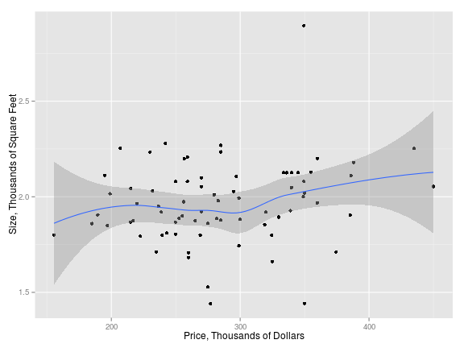

Home Prices
========================================================

## Introduction
The data file contains information on 76 single-family homes in
Eugene, Oregon during 2005.  At the time the data were collected, the
data submitter was preparing to place his house on the market and it
was important to come up with a reasonable asking price.  Whereas
realtors use experience and local knowledge to subjectively value a
house based on its characteristics (size, amenities, location, etc.)
and the prices of similar houses nearby, regression analysis provides
an alternative that more objectively models local house prices using
these same data.  Better still, realtor experience can help guide the
modeling process to fine-tune a final predictive model.  For example,
both realtor experience and regression modeling results suggest the
need for a BathBed interaction term and an Age-squared transformation
in the model.

## Variable Descriptions

* id = ID number
* Price = sale price (thousands of dollars)
* Size = floor size (thousands of square feet) 
* Lot = lot size category (from 1 to 11)
* Bath = number of bathrooms (with half-bathrooms counting as 0.1)
* Bed = number of bedrooms (between 2 and 6)
* BathBed = interaction of Bath times Bed
* Year = year built
* Age = age (standardized: (Year-1970)/10)
* Agesq = Age squared
* Garage = garage size (0, 1, 2, or 3 cars)
* Status = act (active listing), pen (pending sale), or sld (sold)
* Active = indicator for active listing (reference: pending or sold)
* Elem = nearest elementary school (edgewood, edison, harris, adams,
crest, or parker)
* Edison = indicator for Edison Elementary (reference: Edgewood
Elementary)
* Harris = indicator for Harris Elementary (reference: Edgewood
Elementary)
* Adams = indicator for Adams Elementary (reference: Edgewood
Elementary)
* Crest = indicator for Crest Elementary (reference: Edgewood
Elementary)
* Parker = indicator for Parker Elementary (reference: Edgewood
Elementary)


```r
# Url where the data is located
fileUrl <- "http://www.amstat.org/publications/jse/datasets/homes76.dat.txt"
# Set working directory to where you want to save the file
setwd("/home/tarek/IntroductionToDataScience")
# If homes76.txt does not exist then download it
if (!file.exists("homes76.txt")) {
            download.file(fileUrl, destfile="homes76.txt")}
# Read data
hdata <- read.table("homes76.txt", header=T, sep='\t')

# Rename columns
colnames(hdata) <- c('id', 'Price', 'Size', 'Lot', 'Bath', 'Bed', 'BathBed', 'Year', 
                 'Age','Agesq', 'Garage', 'Status', 'Active', 'Elem', 
                 'Edison Elementary', 'Harris Elementary', 'Adams Elementary', 
                 'Crest Elementary', 'Parker Elementary')
```

## Price vs. Size 


```r
library(ggplot2)
p <- ggplot(data=hdata,aes(x=Price, y=Size)) 
p + geom_point() + geom_smooth(method='loess') + 
            xlab("Price, Thousands of Dollars") + 
            ylab("Size, Thousands of Square Feet")
```

 

